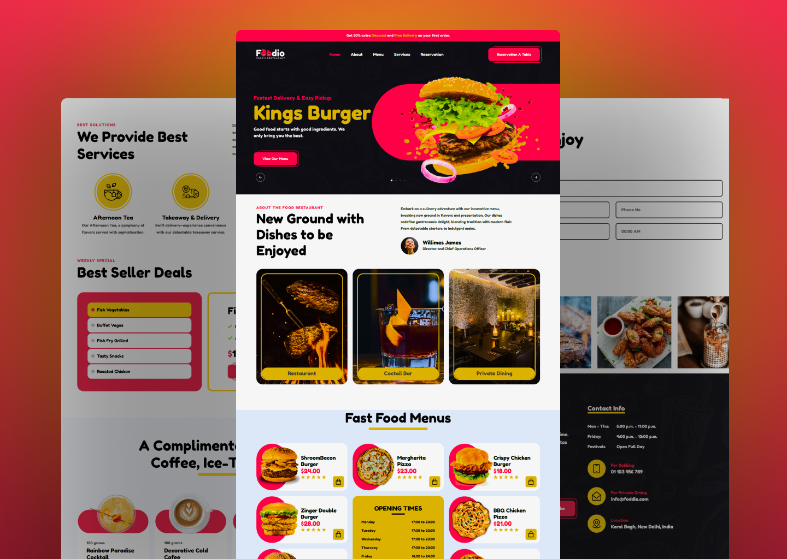

# Modern Restaurant Website

Welcome to the Modern Restaurant Website repository! This project is a responsive restaurant website created with HTML, CSS, and JavaScript. It features a sleek and modern UI design, incorporating an image slider and multiple sections to provide an engaging and delightful user experience.

## Preview



## Features

- **Responsive Design:** Ensures optimal viewing on various devices for a seamless experience.
- **Image Slider:** Showcase the restaurant's ambiance and featured dishes with an interactive image slider.
- **Multiple Sections:** Include dedicated sections for menu, about us, contact information, and more.
- **Modern UI Design:** Stylish and intuitive design elements for an attractive user interface.

## Getting Started

To explore this restaurant website locally, follow these steps:

1. Clone the repository to your local machine:

   ```bash
   git clone https://github.com/Devsethi3/Modern-Restaurant-Website.git
   ```

2. Open the `index.html` file in your preferred web browser.

## Customization

Feel free to customize this website to fit the branding and style of your restaurant. Update images, text, and colors in the HTML and CSS files as needed.

## Contributing

If you'd like to contribute to this project, follow these steps:

1. Fork the repository.
2. Create a new branch for your feature or improvement.
3. Make your changes and commit them with descriptive messages.
4. Push your changes to your forked repository.
5. Open a pull request to merge your changes into the main branch.

Explore the Modern Restaurant Website, provide feedback, and consider contributing to its development. Thank you for checking out the repository!